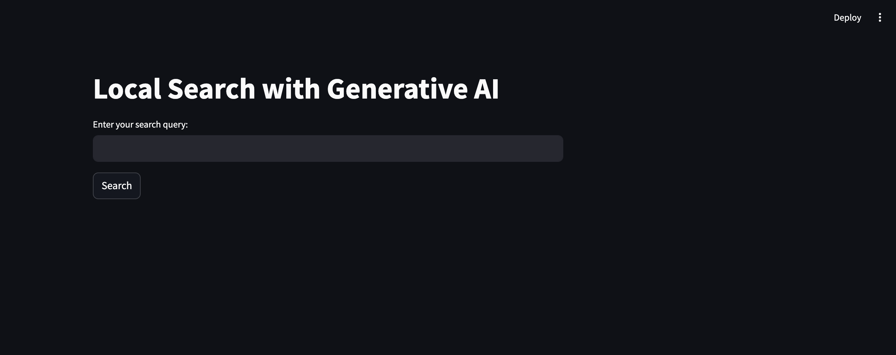
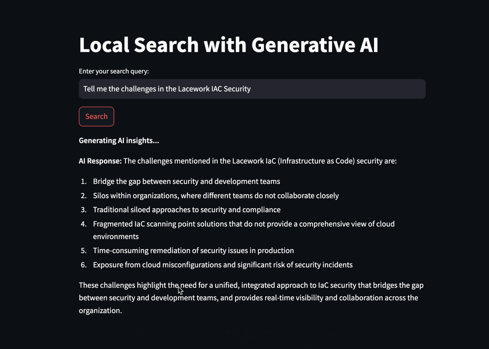
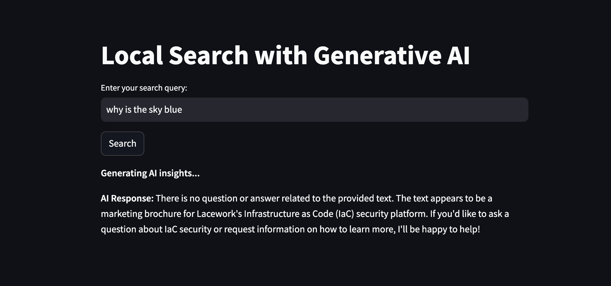

# **Local Search with Generative AI**

This project is a local search tool that leverages **Generative AI** and **FAISS** to index and search local documents. It supports PDF, Word, PowerPoint files, and plain text documents. The search results are enriched with AI-generated responses using a sentence-transformer model and a Generative AI backend.

---

## **Features**

- **Document Preprocessing**: Automatically parses PDFs, Word, PPTX, and plain text files for indexing.
- **FAISS Indexing**: Efficient similarity search powered by FAISS and Sentence Transformers.
- **Generative AI**: Provides AI-driven insights for search queries.
- **Streamlit Web Interface**: Interactive and user-friendly UI for searching and managing documents.
- **Dynamic Index Building**: Build and rebuild indexes for documents on the fly.

---

## **Setup Instructions**

**Prerequisites**

* Python 3.8+
* pip or virtualenv for package management.
* Install Ollama
  ```
  curl -fsSL https://ollama.com/install.sh | sh
  ```

## **Installation**

Clone the repository:
```
git clone git@github.com:hemanthgk10/gen_ai_local_search.git
cd gen_ai_local_search
```

Set up a virtual environment:
```
python -m venv .venv
source .venv/bin/activate
```

Install dependencies:
```
pip install -r requirements.txt
```

Configure the .env file:
Create a .env file in the project root and add your environment variables (e.g., OLLAMA_API_KEY).

## **Running the Application**

* Start the Streamlit app:
```
streamlit run main.py
```

* Open your browser and navigate to http://localhost:8501.



* Search Results




## **Building and Searching the Index**

* Place your documents in the resources/ folder.
* Rebuild the index using the "Build Index" button in the app UI or modify the code to pre-build it during initialization.

## **Usage**

* Upload your documents into the resources/ folder.
* Start the application.
* Use the search bar in the Streamlit interface to query indexed documents.
* View the results and AI-generated insights for your query.

## **Customizing the Tool**

**Adding More File Types**

Update `app/preprocess.py` to include parsers for additional file types.


## **Tech Stack**

- **Backend Libraries**:
  - `faiss-cpu`: For fast similarity search.
  - `sentence-transformers`: Embeddings for semantic search.
  - `numpy`: Numerical computations.
  - `PyPDF2`, `python-docx`, `python-pptx`: Document parsing.
  - `requests`: API integration.

- **Frontend Framework**:
  - `streamlit`: Interactive web app.
  - `streamlit-lottie`: For animations.

- **Environment Configuration**:
  - `python-dotenv`: Manage environment variables.

- **Generative AI Integration**:
  - `ollama`: AI backend for generative responses.

---

## **Project Structure**

```plaintext
.
├── resources/              # Directory for storing documents to be indexed.
├── app/
│   ├── __init__.py         # Marks app as a module.
│   ├── preprocess.py       # Handles document parsing and text extraction.
│   ├── search.py           # FAISS-based search functionality.
│   ├── generate.py         # AI response generation logic.
├── main.py                 # Streamlit app entry point.
├── requirements.txt        # Project dependencies.
├── .env                    # Environment variables (e.g., API keys).
└── README.md               # Project documentation.
```


